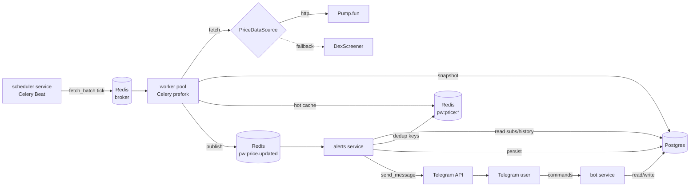
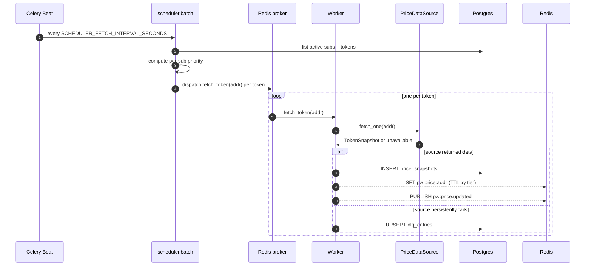
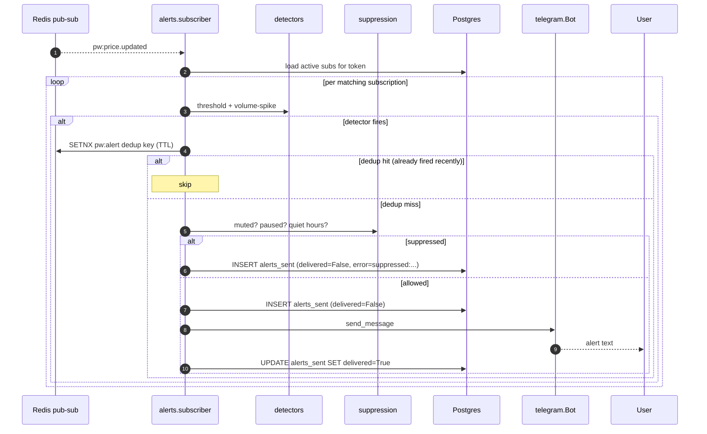

# PumpWatch

Multi-user Telegram bot that watches Solana memecoin tokens on
Pump.fun / DexScreener and fires real-time **price-threshold** and
**statistical volume-spike** alerts to each user's personal watchlist.

> **Status:** Released — eight planned sessions complete. Production
> deployment recipe in [`docs/deployment.md`](docs/deployment.md);
> architecture decisions in [`docs/adr/`](docs/adr/).

PumpWatch is read-only: no private keys, no trade execution, no
financial advice.

## What it does

- A user `/start`s the bot, then `/add <mint> <growth%> <stoploss%>`
  to watch any Solana mint with personal thresholds.
- Behind the scenes, a Celery scheduler computes a per-subscription
  priority tier from distance-to-threshold, recent volatility, and
  recent volume; HIGH-tier mints get polled every ~3 s, MEDIUM ~15 s,
  LOW ~60 s.
- A worker pool fetches each token, persists a `PriceSnapshot` to
  Postgres, refreshes a Redis hot cache, and publishes a `pw:price.updated`
  pub-sub event.
- A separate alerts service consumes those events, runs a threshold
  detector and a median+MAD volume-spike detector, deduplicates via
  Redis-TTL keys, applies mute / `PAUSED` / quiet-hours suppression
  (with full timezone + DST support), persists every alert (delivered
  *and* suppressed) to `alerts_sent`, and dispatches via Telegram with
  per-chat + global rate limiting.
- A periodic Beat sweep reconciles transient delivery failures and
  refreshes Prometheus gauges.

## Tech stack

Python 3.12 · asyncio · SQLAlchemy 2.x async · Alembic · Postgres 16 ·
Redis 7 · Celery 5 (Beat + worker) · python-telegram-bot 22 · structlog ·
tenacity · aiolimiter · prometheus-client · Docker Compose · uv ·
ruff · mypy strict · pytest.

## Architecture

Five long-running services plus Postgres and Redis. The bot, scheduler,
and alerts services are single-instance by design (state is in-process
or Beat would double-fire); workers are horizontally scalable.



### Ingestion flow



### Alert dispatch flow



## Quick start

Local dev with Docker Compose. Default `BOT_MODE=polling` so no public
URL or HTTPS is needed.

1. Copy the env template and fill in your Telegram bot token:

   ```bash
   cp .env.example .env
   # Edit .env and set TELEGRAM_BOT_TOKEN to a token from @BotFather.
   ```

2. Start all services:

   ```bash
   docker compose up -d
   ```

3. Watch the bot connect to Telegram:

   ```bash
   docker compose logs -f bot
   ```

   Open the bot in Telegram, send `/start`, then `/add <some-mint> 50 25`.

## Bot usage

Once `bot` is running with a real `TELEGRAM_BOT_TOKEN`:

| Command | What it does |
|---|---|
| `/start` | Create-or-fetch your PumpWatch account (stores `chat_id`). |
| `/help` | List commands and usage notes. |
| `/add <mint> <growth%> <stoploss%>` | Watch a Solana mint with thresholds. Send `/add` alone for a guided flow. |
| `/list` | Show your active subscriptions. |
| `/stop <mint>` | Soft-deactivate a subscription (history kept). |
| `/settings` | Inline keyboard for mute, timezone, default growth %, default stoploss %. |
| `/cancel` | Abort an in-progress `/add` or `/settings` conversation. |

## Scheduler & workers

The scheduler is a single-instance Celery Beat process that rebuilds the
poll set every `SCHEDULER_FETCH_INTERVAL_SECONDS` (default 30s). For each
active subscription it computes a priority tier (HIGH/MEDIUM/LOW) from the
distance to either growth/stoploss threshold, recent volatility, and
recent volume. One `fetch_token` task per unique token is dispatched, and
the worker pool runs them.

```bash
docker compose up -d postgres redis scheduler worker
docker compose exec worker celery -A pumpwatch.celery_app inspect ping
```

The `scheduler` service is deliberately single-instance; running two Beat
processes would fire `fetch_batch` twice per tick. The `worker` service is
horizontally scalable — queue routing (`default`, `high`, `medium`, `low`)
is in place.

### Worker write path

Each `fetch_token` task performs three ordered steps (see
[ADR-015](docs/adr/015-worker-subscription-agnostic.md)):

1. **Fetch** the token from the configured `PriceDataSource`
   (`PRICE_SOURCE=pumpfun|dexscreener|fake`, via the factory in
   `src/pumpwatch/sources/factory.py`). `SourceUnavailableError` is a
   silent skip — the scheduler re-dispatches on the next tick.
2. **Persist** a `PriceSnapshot` row in Postgres. This is the authoritative
   step; everything downstream assumes this row exists.
3. **Hot cache + pub-sub** (best-effort): `SET pw:price:<addr> <json>` with
   a tier-varying TTL (HIGH=60s, MEDIUM=300s, LOW=900s), then `PUBLISH
   pw:price.updated <json>`. A Redis outage warns but does not break the
   snapshot write.

The Redis namespace is `pw:*` throughout. The alert engine subscribes to
`pw:price.updated` and uses a separate `pw:alert:*` prefix for dedup
TTL keys ([ADR-013](docs/adr/013-redis-roles.md)).

## Alert engine

The `alerts` service is a single-instance long-running consumer. It
subscribes to `pw:price.updated` once at startup, then for each event:

1. **Detect** — for every active subscription on the event's token:
   - **Threshold detector** (pure): compares the event's `market_cap_usd`
     against `Subscription.baseline_market_cap` and fires `GROWTH_HIT`,
     `GROWTH_WARNING`, `STOPLOSS_HIT`, or `STOPLOSS_WARNING` per the
     sub's `growth_threshold_pct`, `stoploss_threshold_pct`, and
     `warning_buffer_pct`. Inclusive on the HIT side.
   - **Median + MAD volume-spike detector** (pure): pulls the last
     `VOLUME_SPIKE_WINDOW_SECONDS` of `volume_5m_usd` history (excluding
     the current bar), requires `VOLUME_SPIKE_MIN_SAMPLES`, and fires
     `VOLUME_SPIKE` if `(current - median) / mad >= sub.volume_spike_k`.
2. **Dedupe** — Redis-TTL key `pw:alert:<user>:<token>:<type>`. TTL
   varies per alert type (`*_HIT` = 1h, `*_WARNING` = 5m, spike = 10m).
   On Redis failure, falls back to the DB-side
   `AlertRepository.recent_for_subscription` backstop.
3. **Suppress** — `User.alerts_muted`, `Subscription.priority == PAUSED`,
   or quiet-hours window in the user's timezone (zoneinfo, wrap-around
   and DST handled). Suppressed alerts are still persisted (audit
   trail) with `delivered=False` and `delivery_error="suppressed: ..."`,
   and the dedup key is still set so unmute does not replay a backlog
   ([ADR-017](docs/adr/017-suppress-but-still-persist.md)).
4. **Persist** — write the row to `alerts_sent` *before* dispatching.
   CLAUDE.md invariant.
5. **Dispatch** — `telegram.Bot.send_message` via the alerts-service-
   owned Bot client (separate process from the bot service, same
   token, no `getUpdates` conflict —
   [ADR-016](docs/adr/016-telegram-dispatch-shape.md)). Per-chat + global
   `aiolimiter` rate limits. One inline retry on `TelegramError`; second
   failure marks `delivery_error` on the already-persisted row and the
   loop keeps consuming.

```bash
docker compose up -d postgres redis bot scheduler worker alerts
docker compose logs -f alerts

# Watch dedup keys land
docker compose exec redis redis-cli --scan --pattern 'pw:alert:*'

# See recent alert rows
docker compose exec postgres psql -U pumpwatch -d pumpwatch -c \
  "SELECT id, subscription_id, alert_type, delivered, delivery_error, created_at \
   FROM alerts_sent ORDER BY id DESC LIMIT 10;"
```

## Hardening & operations

### Worker DLQ — persistently failing tokens

Transient `PumpFunUnavailableError` / `DexScreenerUnavailableError`
get one Celery-level retry with exponential backoff
(`WORKER_FETCH_MAX_CELERY_RETRIES=1` by default). On retry exhaustion
the failure is upserted into `dlq_entries` with the original silent-skip
return shape preserved so the scheduler's re-dispatch logic is unchanged
([ADR-018](docs/adr/018-dlq-postgres-not-redis.md)).

```bash
# What's currently dead-lettered?
docker compose exec postgres psql -U pumpwatch -d pumpwatch -c \
  "SELECT token_address, attempts, first_seen, last_seen, error \
   FROM dlq_entries ORDER BY last_seen DESC LIMIT 20;"
```

### Alert reconciliation

A Beat-driven `pumpwatch.alerts.reconcile_failed` task runs every
`ALERT_RECONCILE_INTERVAL_SECONDS` (default 5 min) and re-dispatches
recently-failed `alerts_sent` rows. ADR-017 holds: rows whose
`delivery_error` starts with `"suppressed:"` are never re-dispatched.
Each row is touched at most twice (once live, once reconciled) — capped
by `ALERT_RECONCILE_MAX_ATTEMPTS=1`.

### DexScreener fallback source

```bash
PRICE_SOURCE=dexscreener docker compose up -d worker
docker compose logs -f worker
```

Same Protocol as `PumpFunClient` — `fetch_one` + `fetch_batch` against
`/latest/dex/tokens/{a,b,c}`, tenacity retry, `api_call_log` writes.
Pair selection: highest-liquidity Solana pair per requested address
([ADR-020](docs/adr/020-dexscreener-as-fallback.md)).

### Prometheus + Grafana (opt-in)

```bash
docker compose --profile observability up -d
open http://localhost:9090   # Prometheus
open http://localhost:3000   # Grafana (anonymous Viewer)
```

Per-service `/metrics` endpoints (bot:9101, scheduler:9102,
worker:9103, alerts:9104) export:

- `pumpwatch_alerts_fired_total{type}` — alerts persisted before suppression
- `pumpwatch_alerts_suppressed_total{reason}`
- `pumpwatch_alerts_delivery_failed_total`
- `pumpwatch_source_calls_total{source,status}`
- `pumpwatch_celery_queue_depth{queue}` (refreshed every 15s)
- `pumpwatch_dlq_size`

The pre-provisioned dashboard at `Dashboards → PumpWatch` covers all
six metrics. The worker container sets `PROMETHEUS_MULTIPROC_DIR`
so `prometheus_client` aggregates across the prefork pool
([ADR-019](docs/adr/019-prometheus-per-service.md)).

**Production note:** the `9090` and `3000` ports are bound to localhost
in the dev compose file. Do **not** expose them publicly. The
deployment guide covers two safe access patterns (SSH tunnel or Caddy
basic-auth).

## Deployment

The production deployment recipe — Hetzner CX22 + docker-compose +
Caddy reverse-proxy — lives in
[`docs/deployment.md`](docs/deployment.md). Webhook bot mode is
selected via `BOT_MODE=webhook` and a public `BOT_WEBHOOK_URL`; dev
compose stays on long-polling.

## Architecture decisions

Non-trivial decisions live as per-file ADRs in
[`docs/adr/`](docs/adr/) (CLAUDE.md format: Context / Decision /
Consequences). One-line decisions stay inline in
[`PROJECT_STATUS.md`](PROJECT_STATUS.md) as a quick-reference index.

## Development

Install dependencies locally (requires [uv](https://docs.astral.sh/uv/)):

```bash
uv sync
```

Run checks:

```bash
uv run pytest                  # tests
uv run ruff check .            # linter
uv run ruff format .           # formatter
uv run mypy --strict src tests # type checker
uv run alembic current         # migration status (requires running Postgres)
```

## Project structure

```
pumpwatch/
├── docker-compose.yml
├── Dockerfile
├── pyproject.toml
├── .env.example
├── alembic.ini
├── alembic/
│   ├── env.py
│   ├── script.py.mako
│   └── versions/
├── docs/
│   ├── adr/                    # architecture decision records
│   ├── deployment.md           # Hetzner + docker-compose + Caddy recipe
│   └── migrations/             # ready-to-run plans for future schema changes
├── ops/
│   ├── prometheus/             # prometheus.yml
│   └── grafana/                # provisioning + dashboards
├── src/
│   └── pumpwatch/
│       ├── config.py           # pydantic-settings
│       ├── logging.py          # structlog setup
│       ├── celery_app.py       # Celery application + Beat schedule
│       ├── db/                 # SQLAlchemy models + repos
│       ├── sources/            # PriceDataSource Protocol + clients (pumpfun, dexscreener, fake)
│       ├── cache/              # Redis hot-cache + pub-sub helpers
│       ├── bot/                # Telegram bot: handlers, validators, app factory, run() entry
│       ├── scheduler/          # Celery tasks: batch builder, priority tiers, fetch_token
│       ├── alerts/             # subscriber loop, detectors, dedup, suppression, dispatcher, reconciler
│       └── observability/      # Prometheus metrics + Beat refresh task
└── tests/
    ├── conftest.py
    └── ...
```

## License

Private repository. Not licensed for redistribution.
